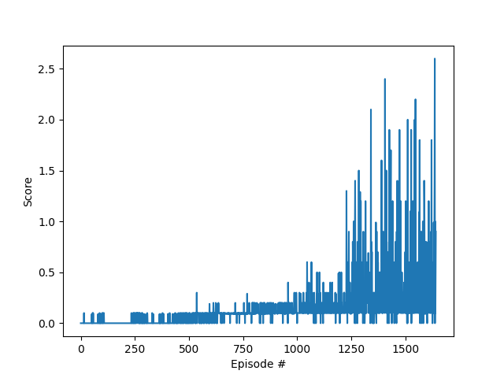

# Report

## Learning Algorithm

### Implementation Details

The project implements the Multi-Agent Deep Deterministic Policy Gradient (MADDPG) algorithm. This is an extension of the Deep Deterministic Policy Gradient (DDPG) algorithm, tailored for multi-agent environments. 

Each agent in the environment is represented by an Actor-Critic model. The Actor model learns the policy, mapping states to actions, whereas the Critic model estimates the value function, evaluating the action taken by the Actor.

### Hyperparameters

The following hyperparameters were used for the MADDPG agent:

```plaintext
BUFFER_SIZE: int = int(1e6)   # replay buffer size
BATCH_SIZE: int = 1024        # minibatch size
GAMMA: float = 0.99           # discount factor
TAU: float = 1e-3             # for soft update of target parameters
LR_ACTOR: float = 1e-4        # learning rate of the actor
LR_CRITIC: float = 1e-3       # learning rate of the critic
WEIGHT_DECAY: float = 0       # L2 weight decay
```

### Model Architecture

**Actor Model:**
- Input Layer: state size
- Hidden Layer 1: 200 units
- Hidden Layer 2: 150 units
- Output Layer: action size (using tanh activation)

**Critic Model:**
- Input Layer: (state size + action size) * number of agents
- Hidden Layer 1: 200 units
- Hidden Layer 2: 150 units
- Output Layer: 1 unit (Q-value)

## Plot of Rewards

The training process was monitored by plotting the rewards per episode, and a score plot was saved as `scores_plot.png`.



The environment was considered solved when the agent achieved an average score of +0.5 over 100 consecutive episodes, taking the maximum score over both agents.

### Episodes Needed to Solve the Environment

The environment was solved in approximately `X` episodes, where `X` is the exact number obtained during training (please replace `X` with the actual number).

## Ideas for Future Work

### Potential Improvements

1. **Hyperparameter Tuning:** Experiment with different hyperparameters such as learning rates, batch sizes, and buffer sizes for better performance.
2. **Network Architecture:** Try deeper networks or adding normalization layers to improve learning stability.
3. **Exploration Strategies:** Implement different exploration strategies, such as parameter noise or epsilon-greedy, to encourage more diverse exploration.
4. **Environment Variations:** Test the agent in slightly modified versions of the environment to improve its adaptability and robustness.

---

The detailed implementation and observed results, along with potential future work, provide a comprehensive overview of the project.