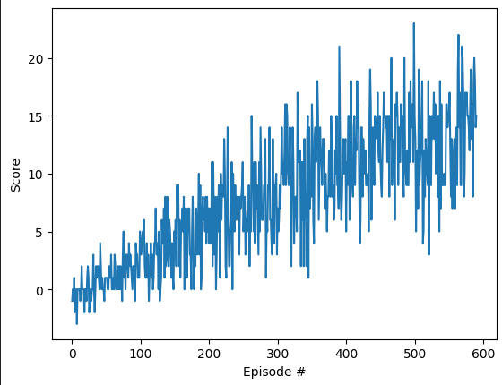

# Project Report: Unity Banana Collector Agent

## Learning Algorithm

### Description
The learning algorithm used for this project is the Deep Q-Network (DQN). DQN is a value-based reinforcement learning algorithm. The key idea behind DQN is to use a neural network to approximate the Q-value function, which predicts the total reward an agent can expect to receive after taking a particular action in a given state and then following a certain policy.

### Model Architecture
The architecture of the neural network used in this project consists of:
- **Input Layer**: Accepts the state vector of size 37.
- **Hidden Layers**: Two fully connected hidden layers each with 64 units and ReLU activation functions.
- **Output Layer**: A fully connected layer with a size equal to the number of actions (4), representing the Q-values for each action.

```python
class QNetwork(nn.Module):
    def __init__(self, state_size, action_size, seed):
        super(QNetwork, self).__init__()
        self.seed = torch.manual_seed(seed)
        self.fc1 = nn.Linear(state_size, 64)
        self.fc2 = nn.Linear(64, 64)
        self.fc3 = nn.Linear(64, action_size)

    def forward(self, state):
        x = F.relu(self.fc1(state))
        x = F.relu(self.fc2(x))
        return self.fc3(x)
```

### Hyperparameters
The hyperparameters chosen for training the DQN agent are:
- **Buffer Size**: 100,000 (the size of the replay memory buffer)
- **Batch Size**: 64 (the size of the mini-batch sampled from the replay memory)
- **Gamma**: 0.99 (the discount factor)
- **Tau**: 0.001 (for soft update of target parameters)
- **Learning Rate**: 0.0005 (learning rate for the Adam optimizer)
- **Update Frequency**: 4 (how often to update the network)

## Plot of Rewards

The following plot shows the reward received by the agent per episode over the training period. The agent was able to achieve an average reward of +13 over 100 consecutive episodes in **591 episodes**. The environment was thus solved in **491 episodes**, with the agent achieving the required average score of +13.



### Training Progress

- **Episode 100**: Average Score: 0.85
- **Episode 200**: Average Score: 4.05
- **Episode 300**: Average Score: 6.92
- **Episode 400**: Average Score: 10.05
- **Episode 500**: Average Score: 12.36
- **Episode 591**: Average Score: 13.00

Environment solved in **491 episodes**! Average Score: 13.00

## Ideas for Future Work

Here are some concrete ideas to further improve the agent's performance:

1. **Double DQN**: Use Double Deep Q-Learning to reduce the overestimation bias of Q-values.
2. **Prioritized Experience Replay**: Implement prioritized experience replay to improve the learning efficiency by replaying important transitions more frequently.
3. **Dueling Networks**: Use dueling network architecture to separately estimate the state value and advantage functions to provide more stability to the learning process.
4. **Parameter Noise**: Introduce noise in the network parameters to encourage exploration during training.
5. **Hyperparameter Tuning**: Experiment with different hyperparameters configurations, such as learning rates, discount factors, and network architectures, to find more optimal settings.
6. **Curiosity-Driven Learning**: Implement intrinsic motivation using curiosity-based exploration strategies to enhance learning in sparse reward environments.

By incorporating these enhancements, the performance and efficiency of the agent could potentially be improved.