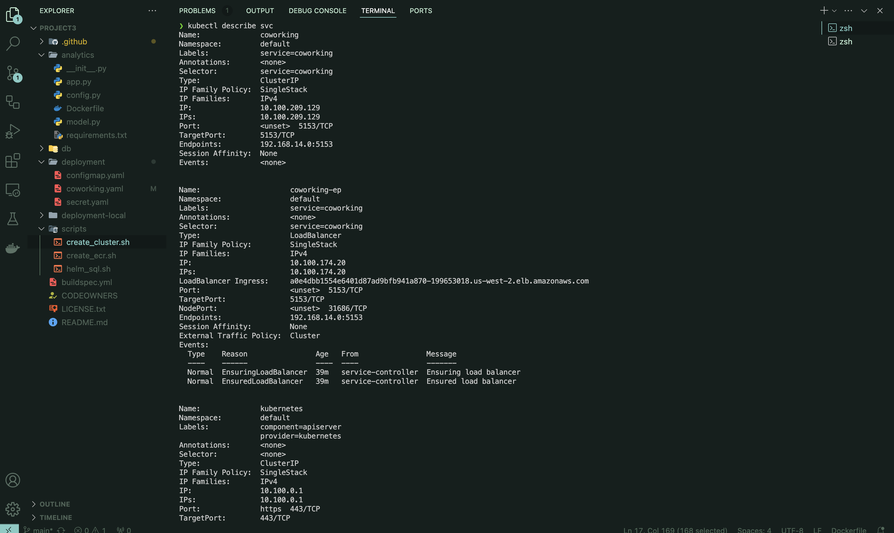
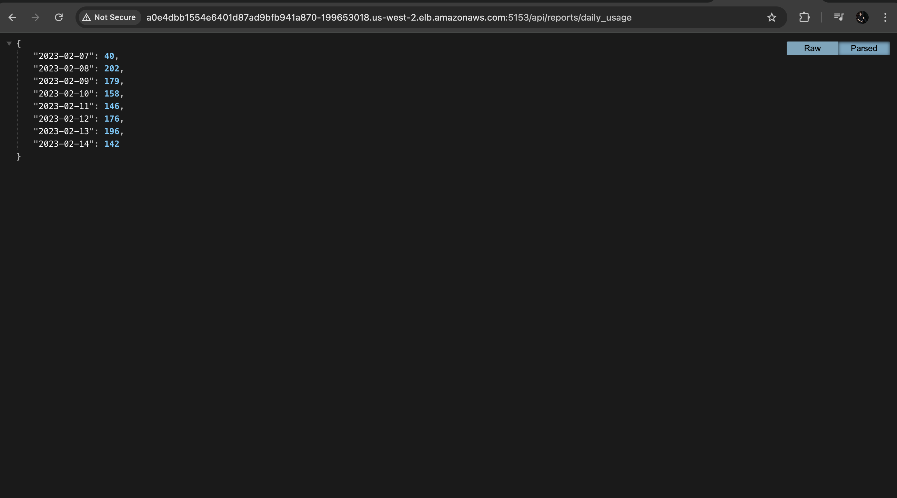
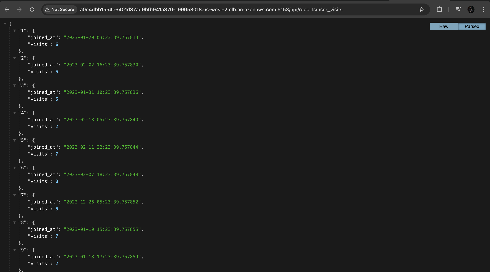
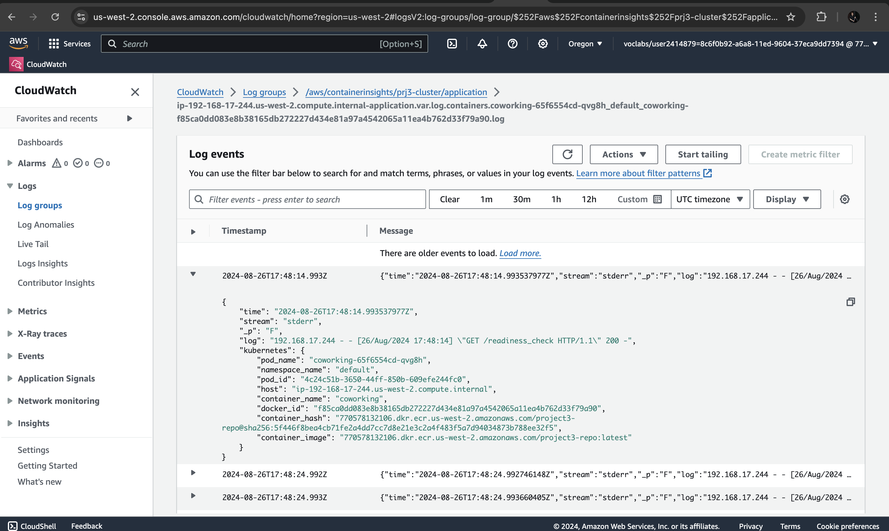

# Project: Operationalizing a Coworking Space Microservice

## Coworking Space Service Extension

The Coworking Space Service comprises a suite of APIs that enable users to request one-time tokens and allow administrators to manage access to coworking spaces. Following a microservice architecture, each service is designed to be deployed and managed independently.

In this project, as the DevOps engineer, you will collaborate with a team responsible for developing an API that delivers key analytics on user activity within the service. Although the application runs smoothly in a local environment, your primary task is to create a pipeline for its deployment in a Kubernetes cluster.

## Getting Started

### Dependencies

#### Local Environment
1. **Python Environment**: Required to run Python 3.6+ applications and install Python dependencies using `pip`.
2. **Docker CLI**: Essential for building and running Docker images locally.
3. **kubectl**: Necessary to execute commands against a Kubernetes cluster.
4. **helm**: Needed to apply Helm Charts to a Kubernetes cluster.

#### Remote Resources

1. **AWS CodeBuild**: Used for remote Docker image builds.
2. **AWS ECR**: Hosts Docker images.
3. **Kubernetes Environment with AWS EKS**: Deploys applications in Kubernetes.
4. **AWS CloudWatch**: Monitors activity and logs in EKS.
5. **GitHub**: Pulls and clones the code repository.


#### Project Structure
```shell

├── CODEOWNERS
├── LICENSE.txt
├── README.md
├── analytics
│   ├── Dockerfile
│   ├── __init__.py
│   ├── app.py
│   ├── config.py
│   ├── model.py
│   └── requirements.txt
├── buildspec.yml
├── db
│   ├── 1_create_tables.sql
│   ├── 2_seed_users.sql
│   └── 3_seed_tokens.sql
├── deployment
│   ├── configmap.yaml
│   ├── coworking.yaml
│   └── secret.yaml
├── deployment-local
│   ├── configmap.yaml
│   └── coworking.yaml
├── screenshots
│   ├── api.png
│   ├── api1.png
│   ├── api2.png
│   ├── api3.png
│   ├── cloudwatch.png
│   ├── codebuild.png
│   ├── codebuild1.png
│   ├── describe_deployment.png
│   ├── describe_svc.png
│   ├── describe_svc1.png
│   ├── ecr.png
│   ├── get_deployment.png
│   └── logs.png
└── scripts
    ├── create_cluster.sh
    ├── create_ecr.sh
    └── helm_sql.sh
```

- `scripts`: Bash scripts to facilitate project tasks.
- `db`: SQL scripts for seeding data.
- `deployment`: Kubernetes YAML files for deployment and configuration.

#### How to Run

1. Run `bin/create-cluster.sh`: Create a Kubernetes cluster and update `kubectl` configuration.
2. Run `bin/helm_sql.sh`: Create a PostgreSQL database service.
3. Run `bin/deployment.sh`: Deploy using `kubectl`.

### CloudWatch Metrics in EKS

Refer to [CloudWatch Metrics in EKS](https://docs.aws.amazon.com/AmazonCloudWatch/latest/monitoring/install-CloudWatch-Observability-EKS-addon.html) for more information on CloudWatch metrics in EKS.

### Get Web API URL

To access the Web API, follow these steps:

1. Get the load balancer external IP:

   ```shell
   kubectl get svc
   ```

   

2. Access the Web API using the provided external IP.

   
   

### CloudWatch

View metrics and logs in CloudWatch:


