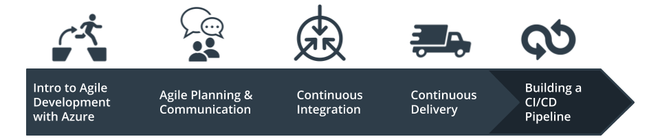
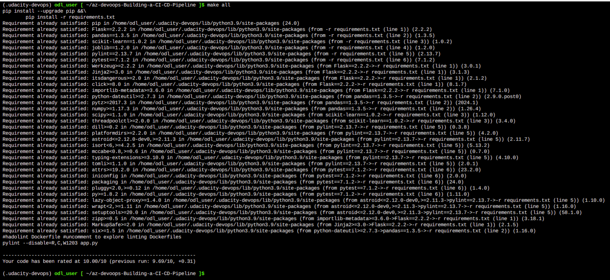
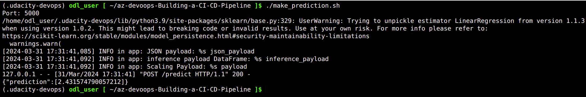
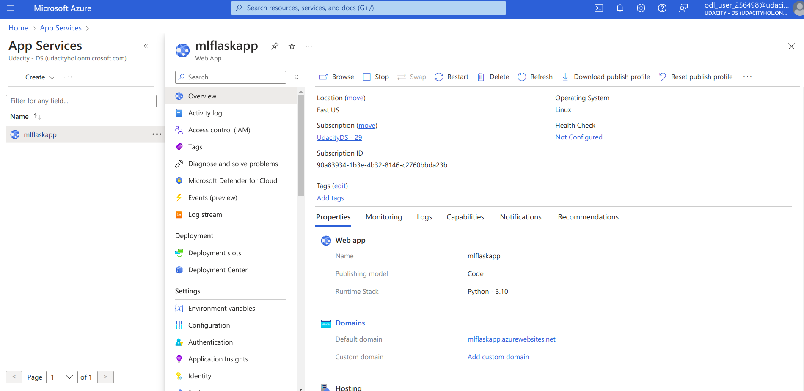
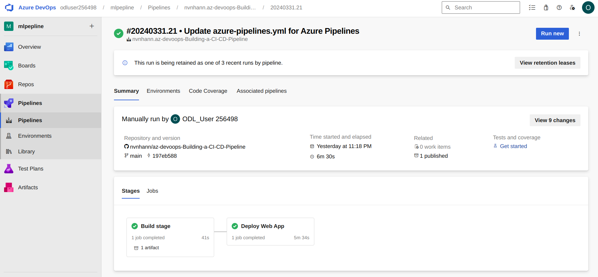
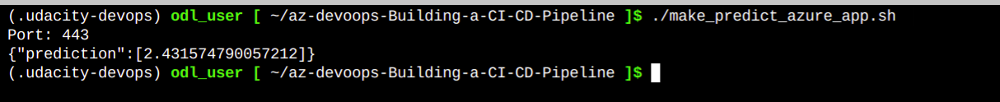
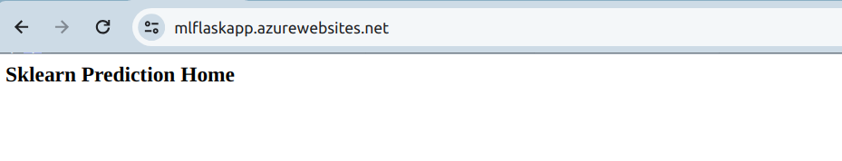
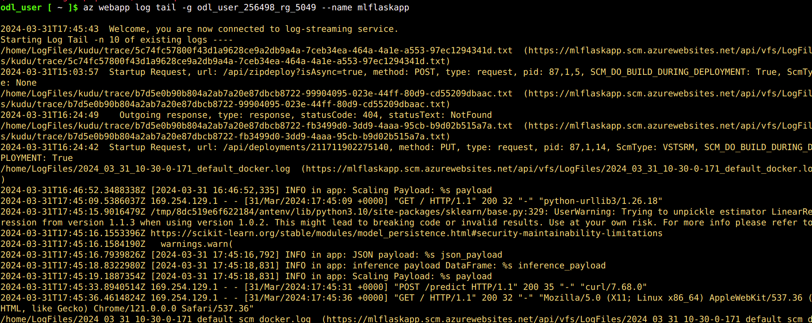
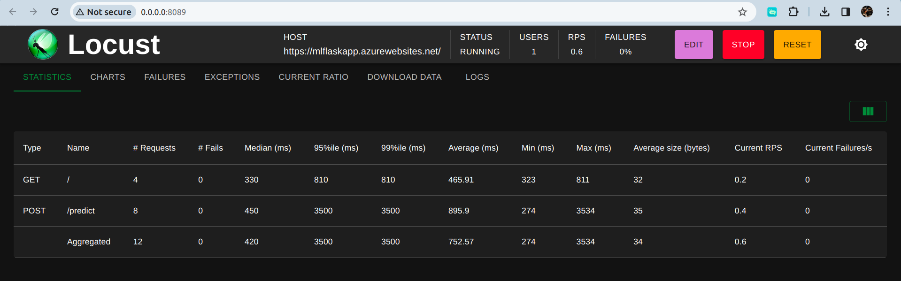

# Building a CI/CD Pipeline

**Author:**: Nhan V.Nguyen

**Course:**: Cloud DevOps using Microsoft Azure

**Date udpate**: 31/03/2024

[](https://github.com/nvnhann/az-devoops-Building-a-CI-CD-Pipeline/actions/workflows/pythonapp.yml)

# Overview



In this project, you will build a Github repository from scratch and create a scaffolding that will assist you in performing both Continuous Integration and Continuous Delivery. You'll use Github Actions along with a `Makefile`, `requirements.txt` and application code to perform an initial lint, test, and install cycle. Next, you'll integrate this project with Azure Pipelines to enable Continuous Delivery to Azure App Service.

---


This submission is for the 'Building a CI/CD Pipeline' project, a requirement for the 'DevOps Engineer for Microsoft Azure' nanodegree program offered by Udacity.

Included in this project is a Python application designed for predicting housing prices in Boston. Please note that I did not develop the Python application myself.

Key features of this repository include:

- Deployment of the application in Azure CloudShell.
- Deployment of the application as an Azure App Service.
- Automated code testing triggered by any commits to the GitHub repository, facilitated by GitHub Actions.
- Implementation of a pipeline in Azure DevOps, ensuring that updated code is automatically tested and deployed to the Azure App Service.

A [Trello](https://trello.com/b/1pMOObsX/az-ci-cd-pepline) board to monitor task progress.

Additionally, a [spreadsheet](./schedule.xlsx) has been set up to oversee the project schedule.

For a visual demonstration of the project, please refer to this [YouTube video](https://www.youtube.com/watch?v=In43hcrVnCc).

## Introduction


In Azure Cloud Shell, clone the repo:

```shell
https://github.com/nvnhann/az-devoops-Building-a-CI-CD-Pipeline
```

Create a virtual environment:


```shell
make setup
```

Activate the virtual environment:

```shell
source ~/.udacity-devops/bin/activate
```

Install dependencies in the virtual environment and run tests:


```shell
make all
```




Start the application in the local environment:

```shell
export FLASK_APP=app.py
```

```shell
flask run &
```

Open a separate Cloud Shell and test that the app is working:



### Deploy the app to an Azure App Service

Create an App Service in Azure. In this example the App Service is called `mlflaskapp`:

```shell
az webapp up --sku F1 -n mlflaskapp -g odl_user_256498_rg_5049
```



Screenshot of a successful run of the project in Azure Pipelines:



Run `make_predict_azure_app.sh` script with the host name of your app. Then run the script:

```shell
./make_predict_azure_app.sh 
```



You can also visit the URL of the App Service via the browser and you should see the following page:



View the app logs:


```shell
az webapp log tail -g odl_user_256498_rg_5049 --name mlflaskapp
```



We can use locust to do a load test against our application. 

```shell
pip install locust
```

```shell
locust -f locustfile.py
```


