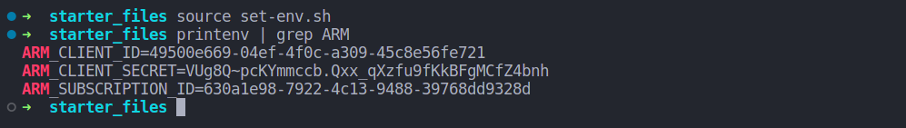

# Azure Infrastructure Operations Project: Deploying a scalable IaaS web server in Azure

**Author**: Nhan V. Nguyen

**Course**: Cloud DevOps using Microsoft Azure

**Date udpate**: 31/03/2024

### Introduction

For this project, you will write a Packer template and a Terraform template to deploy a customizable, scalable web server in Azure.

You've made it to the last part of the course! It's time to work on your final project, **Deploying a Web Server in Azure.**


In this project, you'll have the opportunity to demonstrate the skills you've learned in this course, by creating infrastructure as code in the form of a Terraform template to deploy a website with a load balancer.

#### Scenario

Your company's development team has created an application that they need deployed to Azure. The application is self-contained, but they need the infrastructure to deploy it in a customizable way based on specifications provided at build time, with an eye toward scaling the application for use in a CI/CD pipeline.

Although we’d like to use Azure App Service, management has told us that the cost is too high for a PaaS like that and wants us to deploy it as pure IaaS so we can control cost. Since they expect this to be a popular service, it should be deployed across multiple virtual machines.

To support this need and minimize future work, we will use Packer to create a server image, and Terraform to create a template for deploying a scalable cluster of servers—with a load balancer to manage the incoming traffic. We’ll also need to adhere to security practices and ensure that our infrastructure is secure.

#### Main Steps

The project will consist of the following main steps:
- Creating a Packer template
- Creating a Terraform template
- Deploying the infrastructure
- Creating documentation in the form of a README

We'll go over each of these in more detail on the pages that follow.


### Getting Started
1. Clone this repository

2. Create your infrastructure as code

3. Create your tagging-policy in Azure
   
4. Create your resource group in Azure

### Dependencies
1. Create an [Azure Account](https://portal.azure.com) 
2. Install the [Azure command line interface](https://docs.microsoft.com/en-us/cli/azure/install-azure-cli?view=azure-cli-latest)
3. Install [Packer](https://www.packer.io/downloads)
4. Install [Terraform](https://www.terraform.io/downloads.html)

### Instructions
After gathering your dependencies, the next steps to deploy the scalable web server on Azure are as follows:

1. Deploy the Packer image.
2. Utilize the Terraform template to deploy the necessary infrastructure.

#### Deploy the Packer Image

Packer serves as server templating software, enabling the deployment of virtual machine images. Following the deployment of virtual machines using the Packer template, it's important to delete the Packer images as it doesn't retain state.

##### Config Environment Variables 

Edit environment in ```set-env.sh```

Go to the terminal and export the environment variables like below.

```shell
source set-env.sh
```

After configuring the environment variables and exporting them, verify their settings using ```printenv | grep ARM``` to ensure proper configuration.




#### Deploy the Packer Image

Following command ```packer build server.json```


## Create and Update Azure Resouces with Terraform Template

To utilize variables within your `main.tf` file, you can define them as shown below within your `vars.tf` file.


```terraform
variable "prefix" {
  description = "The prefix which should be used for all resources in this example"
  default = "Azuredevops"
}
```

In `main.tf` call varriable as: `var.prefix`


###  Deploy the Infrastructure Using Terraform

Login azure follwing command: `az login`


`terraform init` command is used to initialize a Terraform working directory by downloading any required plugins and modules specified in your configuration files.


`terraform plan` command in Terraform is used to create an execution plan. This plan describes what actions Terraform will take to change the infrastructure to match the configuration.

By providing the -o flag followed by a file name, you can save the execution plan to a file. This is useful for reviewing or sharing the plan before applying it.

Here's the command you would use:

```shell
terraform plan -out terraform.plan
```


The ```terraform apply``` command in Terraform is used to apply the changes described in the execution plan to the real infrastructure. This command will prompt you to confirm the execution plan before making any changes.


After deploying the infrastructure, you can visit the Azure portal to verify the provisioned resources. Once you're done, ensure to properly destroy these resources to avoid incurring unnecessary costs.

`terraform destroy`


### Output

- `packer build server.json`


- `terraform apply`


- Resource in azure portal


- `terraform destroy`

