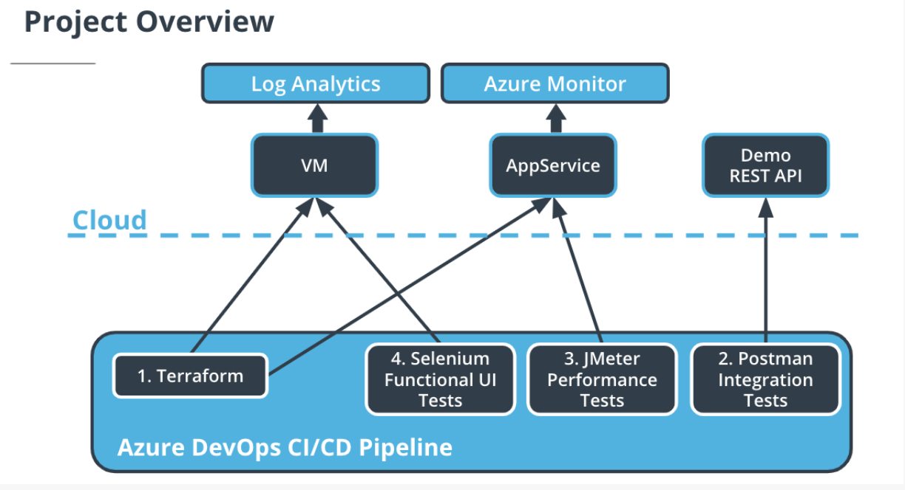

# Ensuring Quality Releases Project

**Author:** Nhan V. Nguyen

**Date:** 06/04/2024

## Project Overview

In this project, you'll develop and demonstrate your skills in using a variety of industry leading tools, especially Microsoft Azure, to create disposable test environments and run a variety of automated tests with the click of a button. Additionally, you'll monitor and provide insight into your application's behavior, and determine root causes by querying the application’s custom log files.

