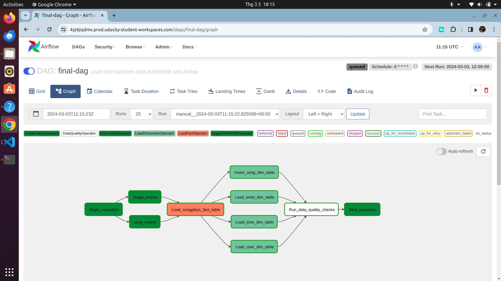

# Project: Data Pipelines

## Project Instructions

### Datasets

For this project, you'll be working with two datasets. Here are the s3 links for each:

Log data: ```s3://udacity-dend/log_data```
Song data: ```s3://udacity-dend/song-data```
Tip: You will want to copy the data to your own bucket.

### Copy S3 Data

The data for the project is stored in Udacity's S3 bucket. This bucket is in the US West AWS Region. To simplify things, we will copy the data to your bucket in the same AWS Region where you created the Redshift workgroup so that Redshift can access the bucket.

If you haven't already, create your own S3 bucket using the AWS Cloudshell (this is just an example - buckets need to be unique across all AWS accounts): ```aws s3 mb s3://sean-murdock/```

Copy the data from the udacity bucket to the home cloudshell directory:

```shell
aws s3 cp s3://udacity-dend/log-data/ ~/log-data/ --recursive
aws s3 cp s3://udacity-dend/song-data/ ~/song-data/ --recursive
aws s3 cp s3://udacity-dend/log_json_path.json ~/
```

Copy the data from the home cloudshell directory to your own bucket -- this is only an example:

```shell
aws s3 cp ~/log-data/ s3://sean-murdock/log-data/ --recursive
aws s3 cp ~/song-data/ s3://sean-murdock/song-data/ --recursive
aws s3 cp ~/log_json_path.json s3://sean-murdock/
```

List the data in your own bucket to be sure it copied over -- this is only an example:

```shell
aws s3 ls s3://sean-murdock/log-data/
aws s3 ls s3://sean-murdock/song-data/
aws s3 ls s3://sean-murdock/log_json_path.json
```

### Configuring the DAG

In the DAG, add ```default parameters``` according to these guidelines

- The DAG does not have dependencies on past runs
- On failure, the task are retried 3 times
- Retries happen every 5 minutes
- Catchup is turned off
- Do not email on retry
  
In addition, configure the task dependencies so that after the dependencies are set, the graph view follows the flow shown in the image below.



Working DAG with correct task dependencies

### Building the operators
To complete the project, you need to build four different operators to stage the data, transform the data, and run checks on data quality.

You can reuse the code from Project 2, but remember to utilize Airflow's built-in functionalities as connections and hooks as much as possible and let Airflow do all the heavy lifting when it is possible.

All of the operators and task instances will run SQL statements against the Redshift database. However, using parameters wisely will allow you to build flexible, reusable, and configurable operators you can later apply to many kinds of data pipelines with Redshift and with other databases.

### Stage Operator
The stage operator is expected to be able to load any JSON-formatted files from S3 to Amazon Redshift. The operator creates and runs a SQL COPY statement based on the parameters provided. The operator's parameters should specify where in S3 the file is loaded and what is the target table.

The parameters should be used to distinguish between JSON files. Another important requirement of the stage operator is containing a templated field that allows it to load timestamped files from S3 based on the execution time and run backfills.

### Fact and Dimension Operators
With dimension and fact operators, you can utilize the provided SQL helper class to run data transformations. Most of the logic is within the SQL transformations, and the operator is expected to take as input a SQL statement and target database on which to run the query against. You can also define a target table that will contain the results of the transformation.

Dimension loads are often done with the truncate-insert pattern, where the target table is emptied before the load. Thus, you could also have a parameter that allows switching between insert modes when loading dimensions. Fact tables are usually so massive that they should only allow append type functionality.

### Data Quality Operator
The final operator to create is the data quality operator, which runs checks on the data itself. The operator's main functionality is to receive one or more SQL based test cases along with the expected results and execute the tests. For each test, the test result and expected result need to be checked, and if there is no match, the operator should raise an exception, and the task should retry and fail eventually.

For example, one test could be a SQL statement that checks if a certain column contains NULL values by counting all the rows that have NULL in the column. We do not want to have any NULLs, so the expected result would be 0, and the test would compare the SQL statement's outcome to the expected result.
