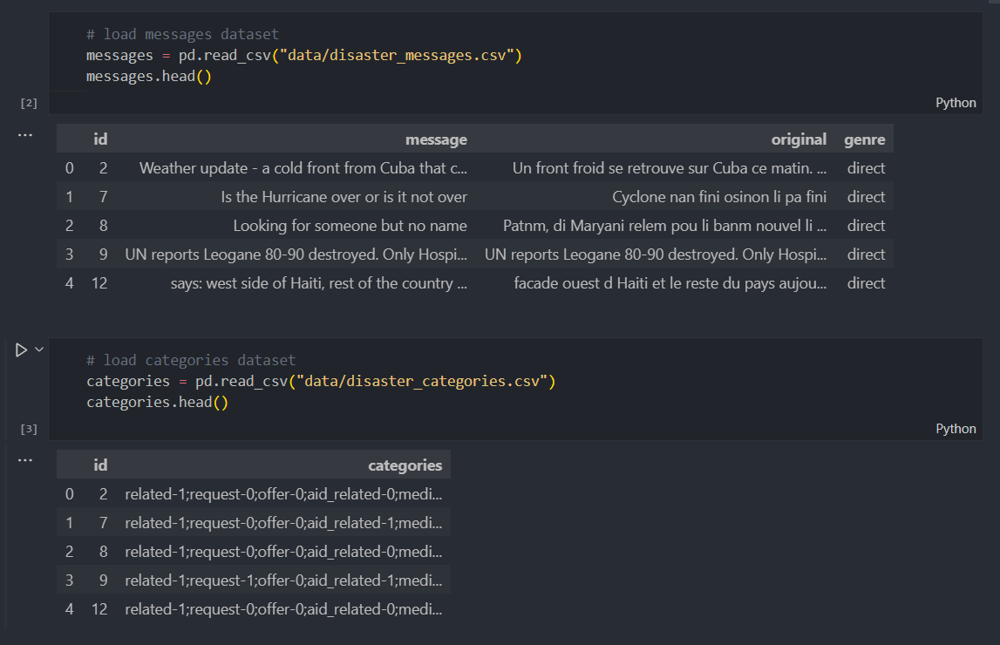
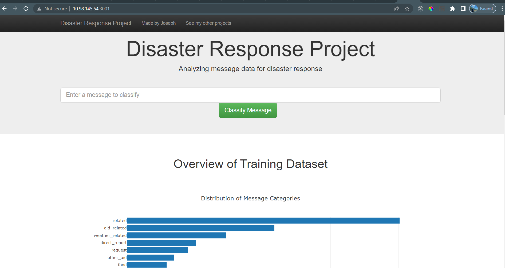
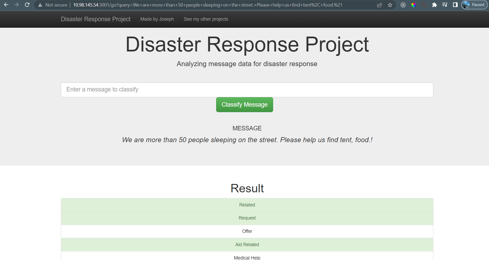

# Disaster Response Pipeline Project
## Summary
>**To develop an API that can classify disaster messages, the analyzed disaster data from Figure Eight can be utilized. This project includes a web app where an emergency worker can enter a new message and receive classification results in various categories. The web app will also display visualizations of the data.**

## How to run the Python scripts and web app:
* To run ETL pipeline that cleans data and stores in database 

    ```shell
    python data/process_data.py data/disaster_messages.csv data/disaster_categories.csv data/InsertDatabaseName.db
    ```

* To run ML pipeline that trains classifier and saves 
    ```shell
    python models/train_classifier.py data/InsertDatabaseName.db models/classifier.pkl
    ```

* Run the following command in the app's directory to run your web app. 
    ```shell
    python run.py
    ```

* Go to http://127.0.0.1:3001

# DATA



# Web App


