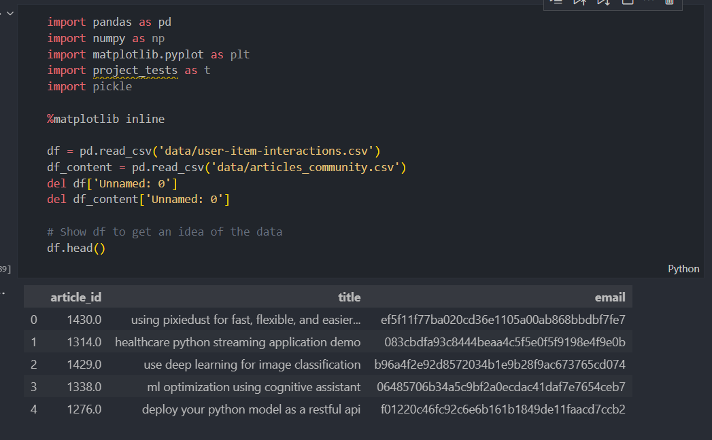
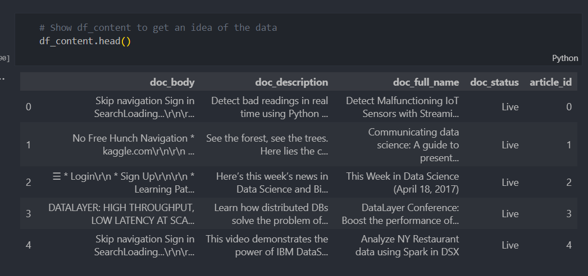
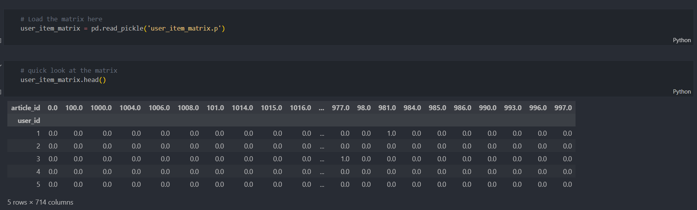
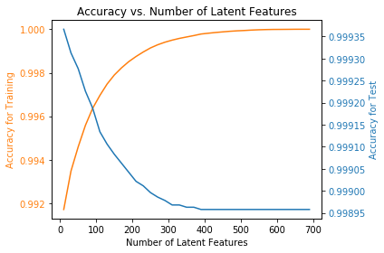

# Project: Recommendation Engines
## Summary
>**At IBM's online data science community, members have the ability to share tutorials, notebooks, articles, and datasets. As part of a project for the IBM Watson Studio data platform, I constructed multiple recommendation engines that utilize user behavior and social networks to present content that is most likely to be pertinent to each individual user.**

# Data

# A pickle file with a matrix of the user_ids and articles

# Model result

# Conclusion

>**The current assessment framework may not be robust enough to make conclusive results about the model. One issue is the cold start problem, where we can only make predictions for users and articles that exist in both the training and test sets. This means that for users in the test set who are not in the training set, we cannot predict articles to recommend to them, leading to a limited number of users in the test set for whom we can make predictions. Accuracy may not be a good metric to use in this case since we are dealing with a limited number of users in the test set. We could consider using other metrics such as precision, recall, or F1 score, which take into account the number of true positives, false positives, and false negatives. To improve the recommendation engine for new users, we could use a blend of techniques, including knowledge-based, collaborative filtering-based, and content-based recommendations. Additionally, we could conduct an A/B test to determine which recommendation technique should be employed. To separate user groups in the A/B test, we could use a variety of methods such as user IDs, cookies, devices, or IP addresses. The length of the experiment will depend on factors such as the number of users, the number of interactions captured for each recommendation system, and the expected effect size. It may be necessary to capture more than 100 interactions for each recommendation system to make an informed decision, especially if the number of users is small.**