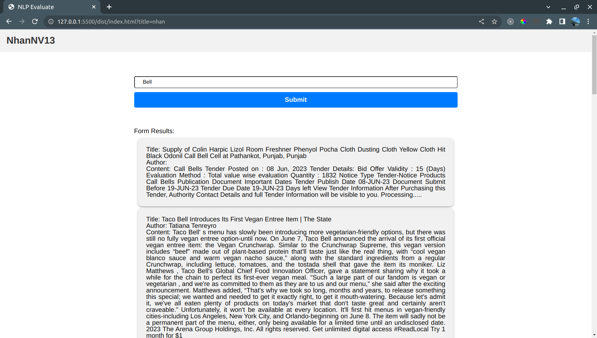
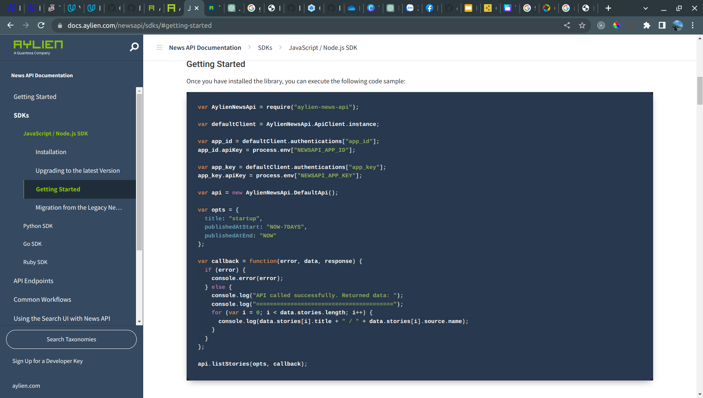
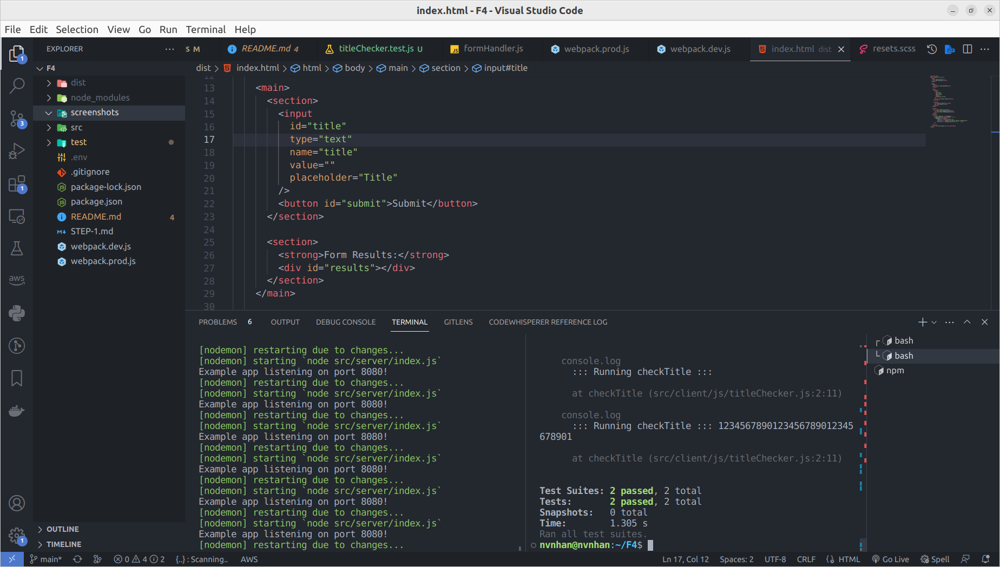

# README
### API
set up in file ```.env```
API_APP_KEY=
API_APP_ID=
### run command 
```npm i```
```npm run build-prod```
```npm start```
Access: ```dist/index.html```
This repository contains the following image screenshots:


 This image shows a screenshot of a web page from the application. It provides a visual representation of the user interface or design of the web page.


This screenshot captures a specific reference or documentation related to the project. It could be a reference to an external website, a document, or any other relevant resource.
For more information, refer to the [Aylien News API SDKs documentation](https://docs.aylien.com/newsapi/sdks/#getting-started).



 This image displays the test results obtained from running Jest, a popular JavaScript testing framework. It provides information about the success test cases.

