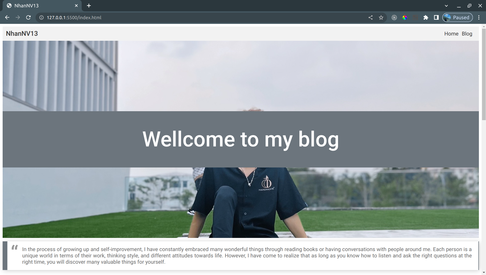
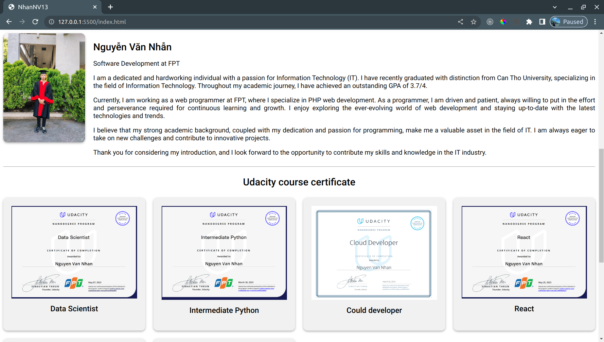
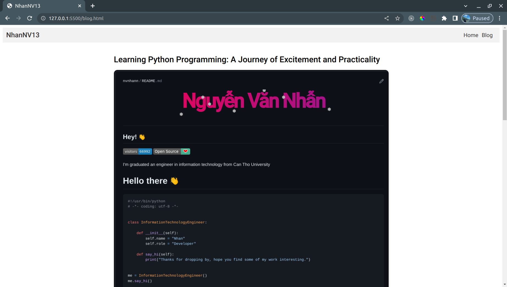
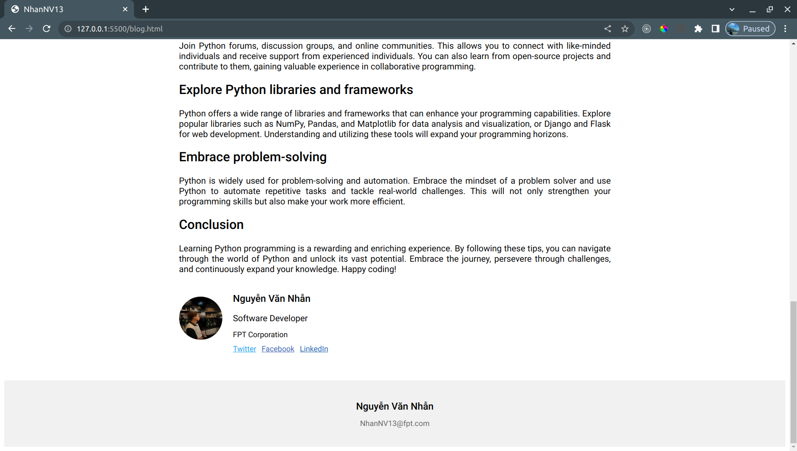

# Personal Blog Website

Welcome to my personal blog website! This website showcases my blog posts and serves as a platform for sharing my thoughts and experiences in various topics.

## Live Website

You can visit the live website by clicking on the following link: [Personal Blog Website](https://nvnhann.github.io/FE/)

## Description

This website is built using HTML, CSS. It features a responsive design that ensures optimal viewing experience across different devices. The blog posts are organized in a user-friendly manner, allowing visitors to easily navigate and explore the content.

## Screenshots

Here are some screenshots of the website:

## Features

- Responsive design for a seamless experience on desktop and mobile devices.
- Clear and intuitive navigation to browse through blog posts.
- Comment section to engage with readers and encourage discussion.
- Social media integration for easy sharing of blog posts on various platforms.

## Installation

1. Clone the repository: `git clone https://github.com/nvnhann/FE.git`
2. Navigate to the project directory: `cd FE`
3. Open the index.html file in your web browser.

## Contributing

If you would like to contribute to this project, please follow these steps:

1. Fork the repository.
2. Create a new branch: `git checkout -b feature/your-branch-name`
3. Make your changes and commit them: `git commit -m 'Add some feature'`
4. Push to the branch: `git push origin feature/your-branch-name`
5. Submit a pull request.

## License

This project is licensed under the [MIT License](LICENSE).

## Contact

If you have any questions or feedback, feel free to reach out to me at [NhanNV13@fpt.com](mailto:NhanNV13@fpt.com).

Thank you for visiting my personal blog website!

