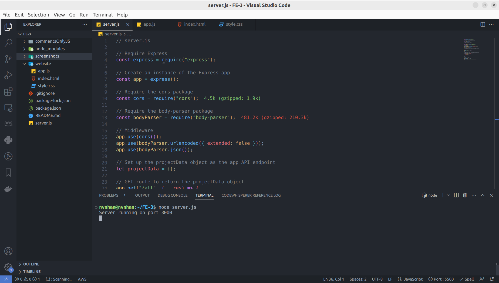
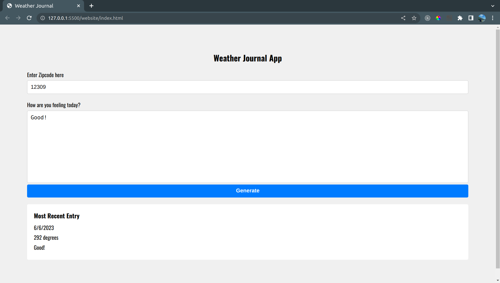

# Weather Journal App

This is a simple web application that allows users to journal their feelings and retrieve weather information based on their location.

## Project Description

The Weather Journal App provides a user-friendly interface where users can enter their zip code and describe how they're feeling. The application then fetches the weather data from the OpenWeatherMap API based on the provided zip code and displays it alongside the user's feelings. Users can also view their most recent entry.

The project is built using Node.js and Express on the server side, while the client side utilizes HTML, CSS, and JavaScript to create a dynamic and interactive user interface.

## Project Features

- User-friendly interface to enter zip code and feelings
- Integration with the OpenWeatherMap API to retrieve weather data
- Display of the most recent journal entry, including date, temperature, and user feelings
- Asynchronous communication between the client and server using fetch API
- Dynamic updating of the UI to reflect the fetched data

## Installation

1. Clone the repository: `git clone https://github.com/nvnhann/FE-3.git`
2. Navigate to the project directory: `cd weather-journal-app`
3. Install the required dependencies: `npm install`

## How to Use

1. Start the local server: `node server.js`
2. Open your web browser and go to: `http://localhost:3000`
3. Enter your zip code and describe your feelings in the provided fields.
4. Click the "Generate" button to fetch weather data and save your entry.
5. The most recent entry will be displayed below, showing the date, temperature, and your feelings.

## Dependencies

- Express.js: Fast, unopinionated, minimalist web framework for Node.js
- CORS: Middleware to enable Cross-Origin Resource Sharing
- Body-parser: Node.js body parsing middleware

## API Reference

The Weather Journal App utilizes the OpenWeatherMap API to retrieve weather data. Make sure to obtain your API key from [OpenWeatherMap](https://openweathermap.org/) and set it in the `apiKey` variable in the `app.js` file.

## Screenshots

## License

This project is licensed under the [MIT License](LICENSE).
