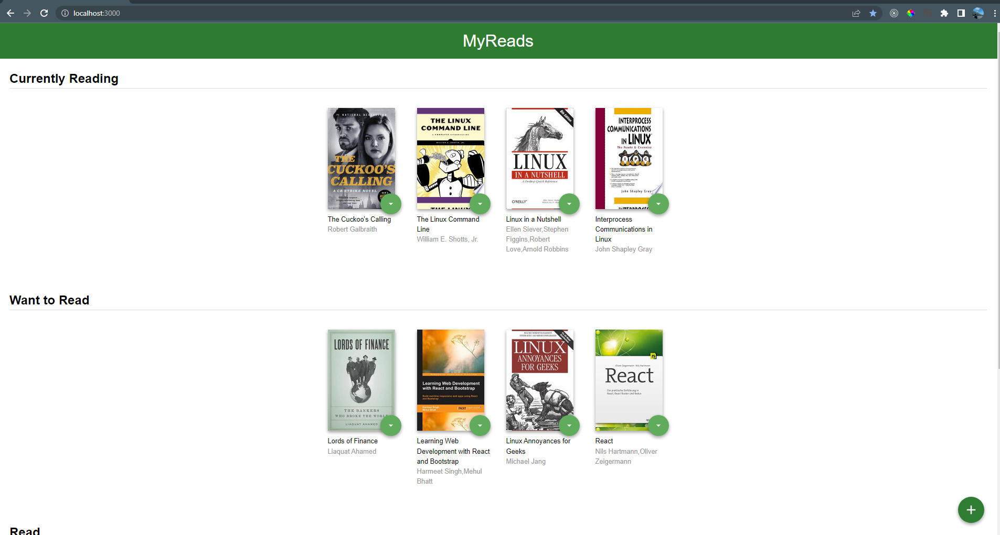

# MyReads Project

This is the starter template for the final assessment project for Udacity's React Fundamentals course. The goal of this template is to save you time by providing a static example of the CSS and HTML markup that may be used, but without any of the React code that is needed to complete the project. If you choose to start with this template, your job will be to add interactivity to the app by refactoring the static code in this template.

Of course, you are free to start this project from scratch if you wish! Just be sure to use [Create React App](https://reactjs.org/docs/create-a-new-react-app.html) to bootstrap the project.
## Home Page
The home page displays three shelves for books, with each book showing its title and authors. Users can interact with a control associated with each book to move them between shelves. The book's state is maintained even when the page is refreshed.

Here's a revised version to convey the same information more clearly:

The home page features three shelves for organizing books. Each book on the page includes its title and a list of authors. Users have the ability to move books between shelves using a control associated with each book. Importantly, when the page is refreshed, the state of the books remains intact, preserving the user's modifications.

## Search Page
The search page incorporates a search input field. As the user enters text into the search field, the page dynamically displays books that match the query. The displayed results include the titles and authors of the matching books. However, when the search input box is emptied, no search results are shown. The search functionality gracefully handles invalid queries, ensuring that prior search results are not displayed. Moreover, the search function operates accurately, even when a book lacks a thumbnail or an author.

## Routing

The main page includes a link that navigates to the search page. Upon clicking the link, the search page is shown, and the URL in the browser's address bar changes to "/search". Conversely, the search page features a link that leads back to the main page. Clicking this link displays the main page again, and the URL in the browser's address bar reverts to "/".

## Code Functionality
Component state is effectively propagated from parent components to their child components. The state variable is handled correctly and is not directly modified. To update the state, the appropriate setState() function is used, ensuring proper state management. The JSX code is well-formatted, ensuring readability and functionality. Additionally, thorough testing has been performed to ensure that no JavaScript errors are present in the console.